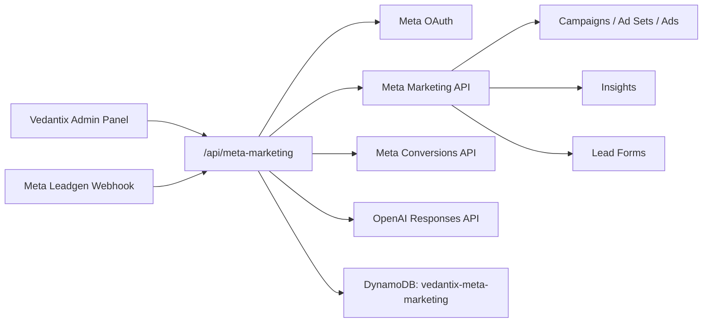

# Vedantix Internal Meta Marketing Platform

## Audit Summary

Existing marketing code was split across customer deployment analytics and the admin analytics UI. The legacy paid-advertising path existed in deployment stages, environment variables, tracking injection, GitHub workflow inputs, backend services, tests and PDF/status UI. That path has been removed from the customer deployment stack.

The Meta implementation is scoped to Vedantix internal marketing only. No customer portal or customer-facing marketing controls are included in this phase.

## Architecture



## Backend Modules

- `MetaAuthService`: OAuth URL generation, token exchange, encrypted token storage, Business Manager/Page/Instagram/Ad Account selection.
- `MetaCampaignService`: create, edit, archive, duplicate, start and stop campaigns.
- `MetaAdSetService`: audience, demographics, interests, locations, placements and budget management.
- `MetaAdService`: image/video creative creation and ad creation.
- `MetaLeadService`: lead ingestion and internal CRM statuses.
- `MetaInsightsService`: spend, leads, revenue and profitability dashboard.
- `MetaConversionsService`: Meta Pixel snippet and Conversions API events.
- `MetaWebhookService`: leadgen webhook verification and ingestion.
- `MetaRecommendationService`: AI ad variants and recommendation generation.

## Database

Single-table DynamoDB storage:

```bash
META_MARKETING_TABLE=vedantix-meta-marketing
```

Partition key:

- `pk`: `META#VEDANTIX`

Sort key prefixes:

- `CONNECTION#vedantix-internal`
- `CAMPAIGN#<uuid>`
- `AD_SET#<uuid>`
- `CREATIVE#<uuid>`
- `AD#<uuid>`
- `LEAD#<uuid>`
- `INSIGHT#<uuid>`
- `AUDIENCE#<uuid>`
- `RECOMMENDATION#<uuid>`
- `AUDIT#<uuid>`

All records include tenant id, audit timestamps, soft-delete fields and actor fields.

## Environment

```bash
META_GRAPH_API_BASE_URL=https://graph.facebook.com
META_GRAPH_API_VERSION=v24.0
META_APP_ID=
META_APP_SECRET=
META_REDIRECT_URI=https://www.vedantix.nl/admin/meta
META_TOKEN_ENCRYPTION_SECRET=
META_WEBHOOK_VERIFY_TOKEN=
META_PIXEL_ID=
META_CONVERSIONS_API_TEST_EVENT_CODE=

OPENAI_API_BASE_URL=https://api.openai.com/v1
OPENAI_API_KEY=
OPENAI_MODEL=gpt-5-mini
```

`META_TOKEN_ENCRYPTION_SECRET` is required before OAuth tokens can be stored. Tokens are encrypted with AES-256-GCM and are redacted from logs and API responses.

## Meta Permissions

The OAuth flow requests the internal Vedantix admin to grant:

- `ads_management`
- `ads_read`
- `business_management`
- `pages_show_list`
- `pages_read_engagement`
- `pages_manage_metadata`
- `instagram_basic`
- `leads_retrieval`

These scopes are used for campaign management, ad account selection, Page/Instagram linking, lead form ingestion and reporting.

## Migration Plan

1. Remove the legacy paid-advertising backend service, deployment stage, environment variables, workflow inputs and tracking injection.
2. Remove the legacy paid-advertising frontend status card, PDF section and polling dependency.
3. Deploy backend with Meta environment variables configured.
4. Open `/admin/meta`, connect Meta OAuth and select Vedantix Business Manager, Ad Account, Page, Instagram and Pixel.
5. Sync insights and verify profitability dashboard.
6. Configure Meta leadgen webhook to `/api/meta-marketing/webhook?tenantId=default`.
7. Add Meta Pixel snippet to the Vedantix website and forward important server events through `/api/meta-marketing/capi/events`.

## Profitability Metrics

The dashboard calculates:

- `CPL = spend / leads`
- `CAC = spend / customers`
- `ROAS = revenue / spend`
- `profit = revenue - ad spend`
- `customerConversionRate = customers / leads`

Revenue is based on lead records marked `WON` with `revenue` or `dealValue`.
